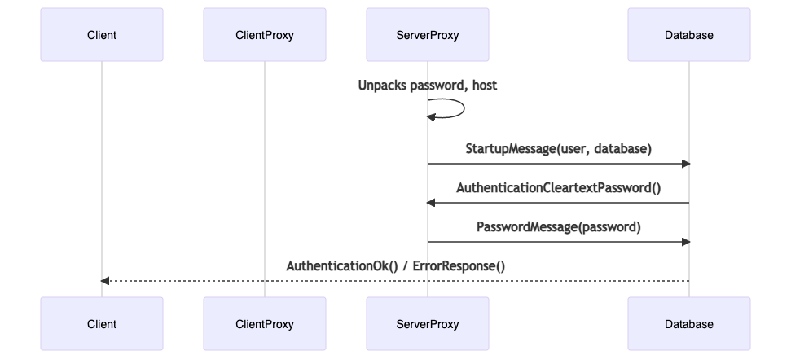

<div align="center">
  <div>
    
    <h1>RDS Auth Proxy</h1>
  </div>
</div>

<p align="center"> 
</p>

<p align="center">
</p>


[](https://goreportcard.com/report/github.com/mothership/rds-auth-proxy)

A two-layer proxy for connecting into RDS postgres databases 
based on IAM authentication. 

This tool allows you to keep your databases firewalled off, 
manage database access through IAM policies, and no developer 
will ever have to share or type a password.


This pairs extremely well with a tool like [saml2aws](https://github.com/Versent/saml2aws)
to ensure all AWS/database access uses temporary credentials.

## Documentation

End user documentation is available on our [project site](https://mothership.github.io/rds-auth-proxy/).

## Design 

One proxy is run in your VPC subnet that can reach your RDS instances,
the other on your client machine (dev laptop, etc.) with access to 
aws credentials.

The client proxy is responsible for picking a host (RDS instance), and 
generating a temporary password based on the local IAM identity. The
client proxy injects the host and password into the postgres startup 
message as additional parameters. 


The server proxy accepts a connection from the client proxy, and 
unpacks the host and password parameters. It then opens a connection 
to the RDS database and intercepts the authentication request. It then 
passes along the password it received from the client, and forwards the 
result to the client.




## Releasing

CI handles building binaries and images on tag events. 

To create a release, start with a dry-run on the main branch:

```bash
git checkout main
./build/release.sh --dry-run
```

Ensure that the changelog looks as expected, then run it for real:

```bash
./build/release.sh
```

