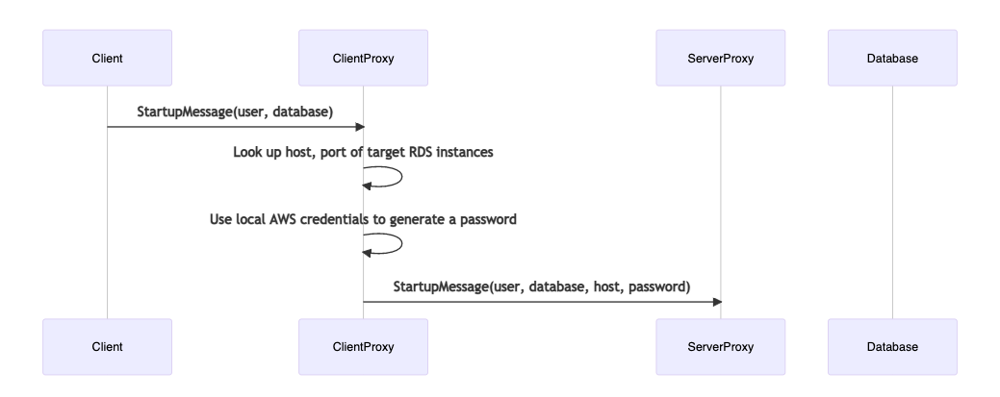
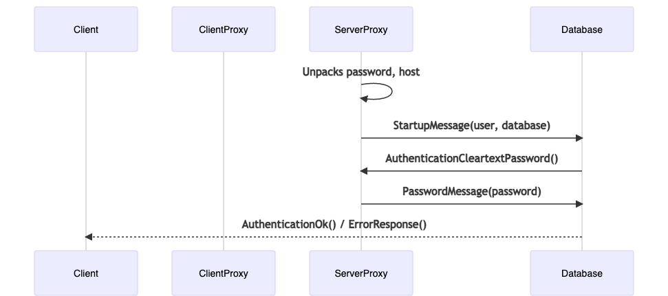

# Architecture 

`rds-auth-proxy` is a binary containing two different proxies.
One proxy is run in a VPC subnet that can reach your RDS instances,
the other on your client machine (dev laptop, etc.) with access to 
aws credentials.

## Client Proxy Startup Flow

The client proxy is responsible for picking a host (RDS instance), and 
generating a temporary password using the local IAM identity. The
client proxy injects the desired host and password into the postgres 
startup message as additional parameters. 

## Server Proxy Startup Flow

The server proxy accepts a connection from the client proxy, and 
unpacks the host and password parameters. The server proxy checks 
that it's allowed to connect to the postgres database, based on 
the set of allowed/blocked tags specified in the config file.

The server proxy then opens a connection to the RDS database and intercepts 
the authentication request. It passes along the password it received from 
the client, and forwards the result to the client. 

After successful auth, all messages are proxied transparently between the 
client and database.
